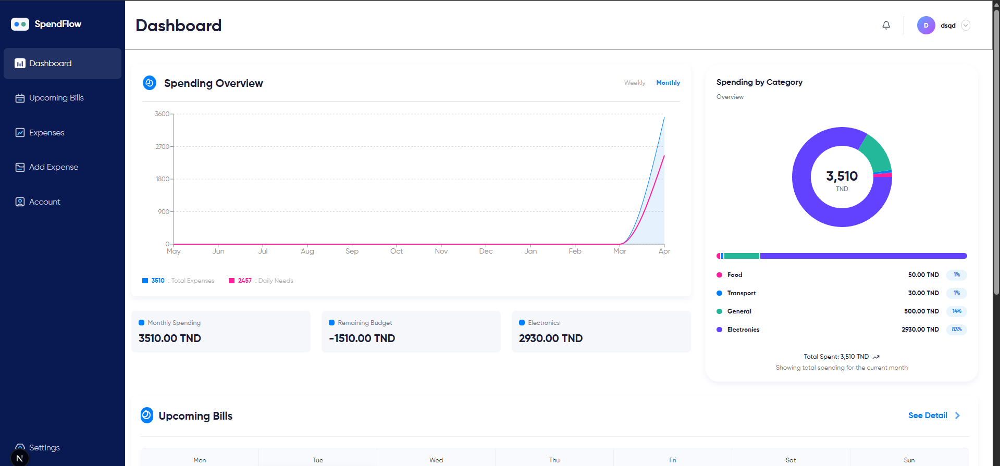
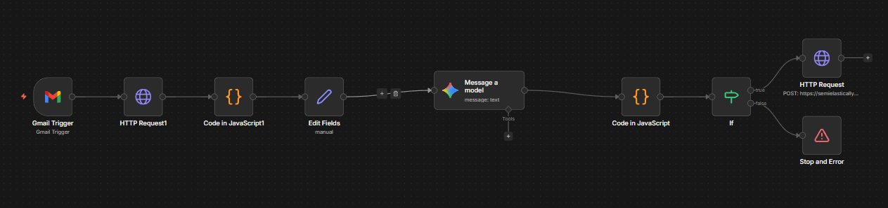

# SpendFlow - Personal Expense Tracker

<p align="center">
  
  
  
  
</p>

SpendFlow is a personal expense tracking and budget management application built with Next.js, TypeScript, Prisma, and MongoDB. It helps you track expenses, visualize spending patterns, and manage your budget effectively.



## 🚀 Features

### Core Features
- **Expense Tracking** - Add, view, and delete expenses with categories
- **Dashboard Analytics** - Visual charts showing monthly/weekly spending trends
- **Budget Management** - Set monthly budget goals and track remaining budget
- **Category Organization** - Organize expenses by custom categories
- **Invoice OCR** - Upload invoice images to auto-extract amount, date, and description using Tesseract.js
- **Calendar View** - See upcoming bills and expenses on a calendar
- **Responsive Design** - Works on desktop and mobile devices

### Authentication
- User registration and login
- Protected routes with NextAuth.js
- JWT-based session management

### Technology Stack
- **Frontend**: Next.js 16 (App Router), React 19, TypeScript
- **Styling**: Tailwind CSS v4 with custom theme
- **Database**: MongoDB via Prisma ORM
- **Authentication**: NextAuth.js with credentials provider
- **Charts**: Recharts
- **Calendar**: FullCalendar
- **OCR**: Tesseract.js for invoice text extraction (client-side)

## 📁 Project Structure

```
spendflow/
├── app/                      # Next.js App Router
│   ├── (pages)/             # Route pages
│   │   ├── dashboard/       # Dashboard with charts
│   │   ├── expenses/       # Expense list
│   │   ├── add-expense/    # Add expense + OCR
│   │   ├── upcoming-bills/ # Calendar view
│   │   ├── login/          # Login page
│   │   ├── register/       # Registration page
│   │   ├── settings/       # User settings
│   │   └── account/        # Account management
│   ├── api/                # API routes
│   │   ├── auth/[...nextauth]/  # NextAuth handler
│   │   ├── dashboard/      # Dashboard data API
│   │   ├── me/             # User info API
│   │   └── orders/         # Orders API
│   ├── actions/            # Server actions
│   │   ├── auth.ts         # Auth actions
│   │   └── expenses.ts     # Expense CRUD
│   └── components/          # Page components
├── components/ui/           # Reusable UI components (shadcn/ui style)
├── lib/                     # Utilities
│   ├── auth.ts             # NextAuth config
│   ├── prisma.ts           # Prisma client
│   └── utils.ts            # Helper functions
├── prisma/
│   └── schema.prisma       # Database schema
└── public/                  # Static assets
```

## 🛠️ Getting Started

### Prerequisites

- Node.js 18+
- MongoDB (local or Atlas)
- npm or yarn

### Installation

1. Clone the repository:
```bash
git clone https://github.com/yourusername/spendflow.git
cd spendflow
```

2. Install dependencies:
```bash
npm install
```

3. Set up environment variables:
```bash
# Create .env file
DATABASE_URL="mongodb://localhost:27017/spendflow"
NEXTAUTH_SECRET="your-secret-key-here"
NEXTAUTH_URL="http://localhost:3000"
```

4. Initialize the database:
```bash
npx prisma db push
```

5. Start the development server:
```bash
npm run dev
```

6. Open [http://localhost:3000](http://localhost:3000)

## 📖 Usage

### Adding an Expense
1. Navigate to **Add Expense** from the sidebar
2. Fill in the form (date, amount, category, type, description)
3. Optionally upload an invoice image for OCR auto-fill
4. Click **Add** to save

### Using OCR Invoice Upload
1. On the Add Expense page, drag or browse for an invoice image
2. The system will extract text using Tesseract.js
3. Amount, date, category, type, and description are auto-filled
4. Review and edit the extracted data
5. Submit the expense

### Viewing Analytics
- The **Dashboard** shows spending trends and category breakdown
- **Monthly Spending Chart** - Track expenses over time
- **Spending by Category** - Pie chart of expense distribution
- **Recent Transactions** - Latest expense entries
- **Upcoming Bills** - Calendar view of future expenses

## 🔗 n8n Integration (Email to Expense)

SpendFlow can automatically create expenses from emails using n8n and Gemini AI. The workflow is located in `spendflow/n8n/workflow.json`.



### How It Works

```
Gmail Trigger → HTTP Request (Get Email) → Code (Parse Email) → Edit Fields → Gemini AI → Code (Parse JSON) → If → HTTP Request (Create Expense)
```

1. **Gmail Trigger** - Monitors inbox for new emails
2. **Gemini AI** - Parses email content to extract expense data
3. **API Route** - Creates expense via `/api/orders`

### n8n Workflow Setup

Import `spendflow/n8n/workflow.json` into your n8n instance.

Required credentials:
- Gmail OAuth2 (for email access)
- Google Gemini API (for AI parsing)

### API Endpoint

| Method | Endpoint | Description |
|--------|----------|-------------|
| POST | `/api/orders` | Create expense from n8n/Gemini |

**Request Body:**
```json
{
  "description": "string",
  "amount": number,
  "category": "string",
  "date": "YYYY-MM-DD",
  "userId": "string"
}
```

**Response:**
```json
{
  "success": true
}
```

## 🔧 Scripts

| Command | Description |
|---------|-------------|
| `npm run dev` | Start development server |
| `npm run build` | Build for production |
| `npm run start` | Start production server |
| `npm run lint` | Run ESLint |
| `npx prisma studio` | Open Prisma database GUI |

## 📄 Environment Variables

| Variable | Description |
|----------|-------------|
| `DATABASE_URL` | MongoDB connection string |
| `NEXTAUTH_SECRET` | Secret for NextAuth.js |
| `NEXTAUTH_URL` | Application URL |

## 🤝 Contributing

Contributions are welcome! Please feel free to submit a Pull Request.

## 📝 License

This project is licensed under the MIT License.

---

<p align="center">Built with ❤️ using Next.js, TypeScript, and MongoDB</p>
